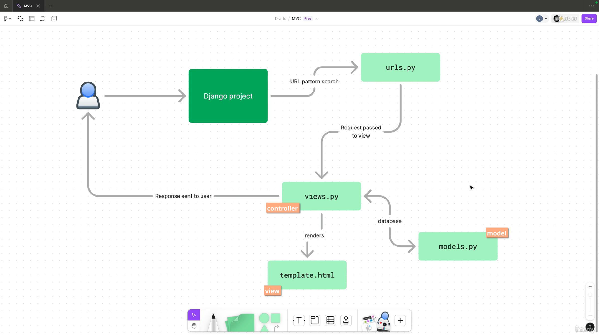

# Full-Stack-Django5-TailwindCSS-HTMX
Full Stack Web Development with Django 5, TailwindCSS, HTMX

---

## Django Course Notes:

* Architecture of the Django Framework: 
* Starting/Creating a new django project: **`$ uv run django-admin startproject <projectname> . `**
* To start the application: **`$ uv run manage.py runserver`**
    * *Ctrl+C* to stop the server.
* Run & apply migrations: **`$ uv run manage.py migrate`**
* Create a superuser: **`$ uv run manage.py createsuperuser`**
* Access the admin panel: `/admin` (http://127.0.0.1:8000/admin)
* Create django app: **`$ uv run manage.py startapp <appname>`**
* Create migrations (for db): **`$ uv run manage.py makemigrations`**
* Django automatically escapes the HTML content, we can turn it off in templates using `{{ content | safe }}`.
*
---
* **Browser Cookie** (a.k.a. HTTP cookie) -- a small block of data created by a web server while a user is browsing a website and placed on the user's computer or other device by the user's web browser. \
https://en.wikipedia.org/wiki/HTTP_cookie
* **CSRF** (Cross-Site Request Forgery / **XSRF**) is an attack that forces an end user to execute unwanted actions on a web application in which they’re currently authenticated. \
https://owasp.org/www-community/attacks/csrf \
https://en.wikipedia.org/wiki/Cross-site_request_forgery
* POST, PUT and DELETE methods are known as "unsafe", which means we should use CSRF protection on them. Other methods are "safe".
* Preventing CSRF attack:
    1. CSRF tokens -- server-generated secret code that must be present in the form.
    2. SameSite cookies -- cookies are not sent from third party sites on form submissions. (This is now default in most browsers)
*
